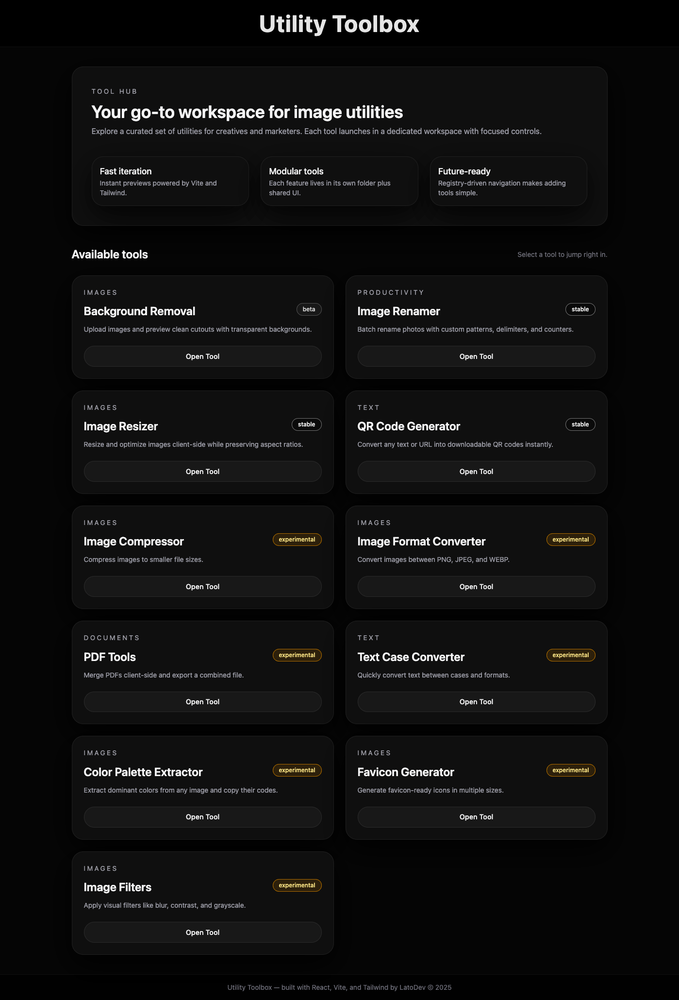
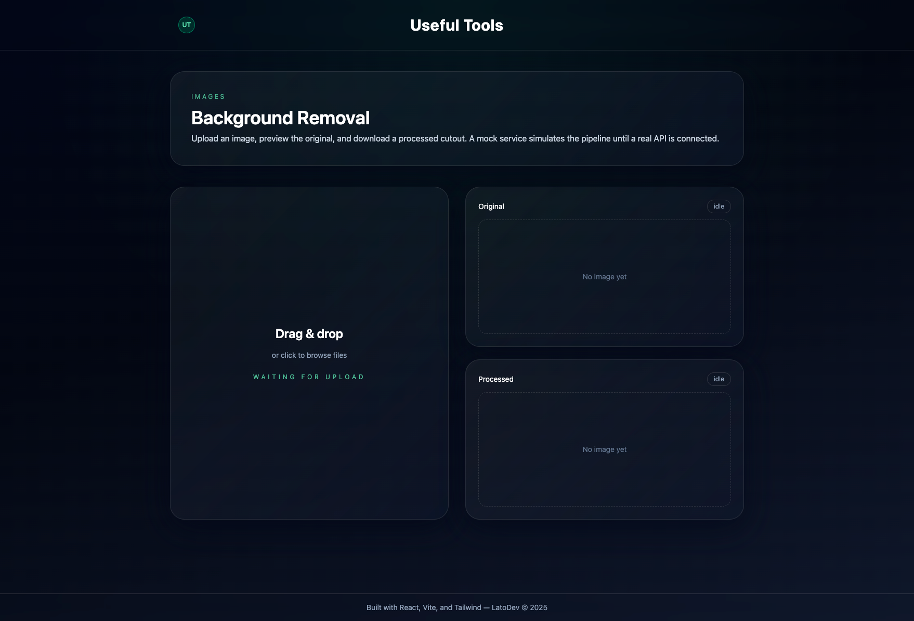
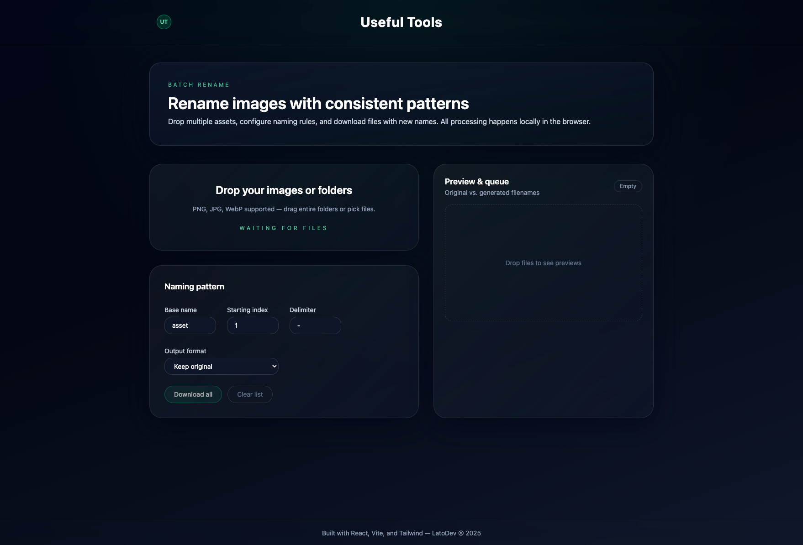
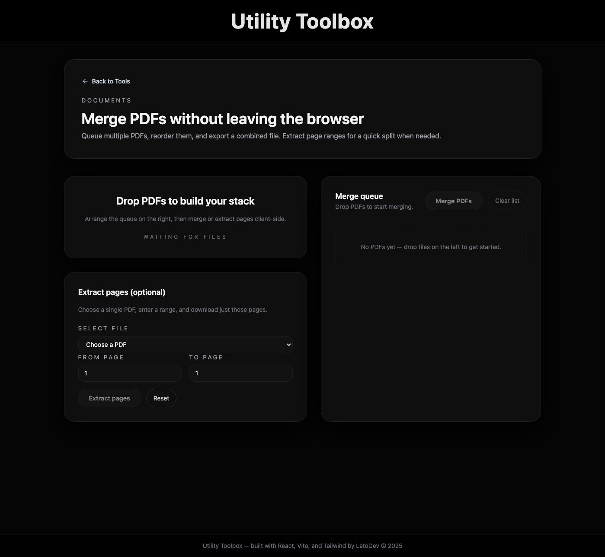
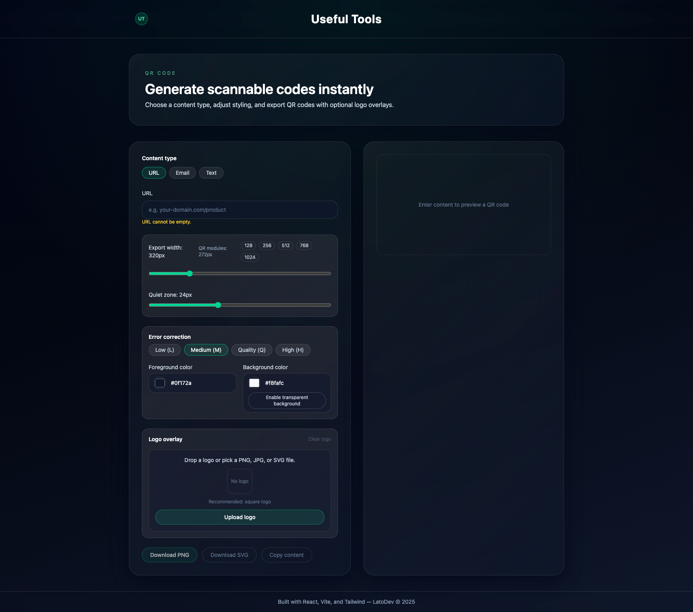
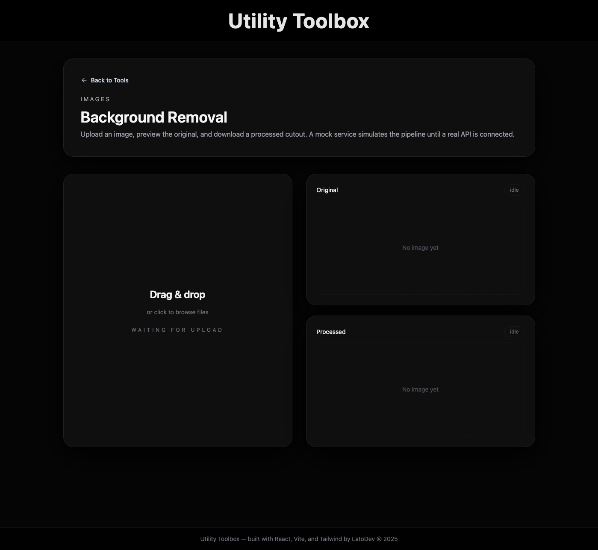

<p align="center">
  
</p>

<h1 align="center">Utility Toolbox</h1>

<p align="center">
  A Vite + React + TypeScript suite of production-ready utilities for designers, marketers, and engineers who need polished image and text workflows in the browser.
</p>

---

## At a Glance

- **11 tools, single shell** – every workflow lives under one responsive layout with shared navigation, theming, and state-handling patterns.
- **React + Vite + Tailwind** – instant HMR in development and optimized builds via Vite, styled exclusively with Tailwind utilities.
- **Feature isolation** – each tool has its own folder, hooks, and services under `src/features/tools`, keeping code paths easy to reason about.
- **Composable services** – pure TypeScript helpers in `src/services` power mock data, file handling, and canvas work without leaking React concerns.

---

## Visual Tour

<div align="center">
  
  
  
</div>
<div align="center">
  
  
  
</div>

---

## Tool Catalog

| Tool                    | Route                      | Status       | Highlights                                                                                          |
| ----------------------- | -------------------------- | ------------ | --------------------------------------------------------------------------------------------------- |
| Background Removal      | `/background-removal`      | Beta         | Drag-and-drop uploads with before/after preview, mock progress states, and transparent PNG exports. |
| Image Renamer           | `/image-renamer`           | Stable       | Batch rename files with custom patterns, delimiters, numbering, and optional extension changes.     |
| Image Resizer           | `/image-resizer`           | Stable       | Canvas-based resizing queue with aspect locking, quality control, and per-file downloads.           |
| QR Code Generator       | `/qr-code-generator`       | Stable       | Generate QR codes from URLs/text, tune error correction, and export PNGs.                           |
| Image Compressor        | `/image-compressor`        | Experimental | Reduce file sizes client-side with adjustable quality targets.                                      |
| Image Format Converter  | `/image-format-converter`  | Experimental | Convert images between PNG, JPG, and WEBP on the fly.                                               |
| PDF Tools               | `/pdf-tools`               | Experimental | Reorder and merge PDF uploads entirely in the browser.                                              |
| Text Case Converter     | `/text-case-converter`     | Experimental | Quickly toggle sentences, camelCase, snake_case, and uppercase/lowercase variants.                  |
| Color Palette Extractor | `/color-palette-extractor` | Experimental | Detect dominant colors in an image and copy hex values instantly.                                   |
| Favicon Generator       | `/favicon-generator`       | Experimental | Produce multi-size favicon sets plus PNG previews.                                                  |
| Image Filters           | `/image-filters`           | Experimental | Apply blur, contrast, grayscale, and other filters with live previews.                              |

---

## Why It Works

### 1. Unified Workspace

Single shell (`src/App.tsx`) wires every route with React Router and keeps header/footer branding consistent. Shared layout primitives ensure each feature inherits the same keyboard and color-accessible interactions.

### 2. Opinionated Components

Buttons, drop zones, and cards live in `src/components`, giving tools a cohesive look while letting feature folders focus solely on domain logic.

### 3. Service-First Logic

Canvas operations, mock APIs, and helpers stay in `src/services`, making it trivial to reuse logic between tools or swap in real endpoints later.

---

## Architecture Snapshot

```text
src/
  App.tsx              # routes + chrome
  main.tsx             # ReactDOM bootstrap
  components/          # shared UI primitives
  features/
    home/              # hub page
    tools/             # per-tool folders + toolRegistry.ts
  services/            # framework-free helpers (image, pdf, text)
public/
  logo.png             # UT circle mark
  screenshots/         # UI showcase assets
```

Refer to `architecture.md` for the authoritative guidelines when adding new modules or categories.

---

## Getting Started

```bash
# install dependencies
npm install

# start the Vite dev server
npm run dev

# run type-check + production build
npm run build
```

Visit `http://localhost:5173` for local development with Hot Module Replacement.

---

## Available Scripts

| Command           | Description                                                       |
| ----------------- | ----------------------------------------------------------------- |
| `npm run dev`     | Launch Vite with HMR.                                             |
| `npm run build`   | Type-check via `tsc -b` and emit the optimized production bundle. |
| `npm run preview` | Serve the built assets locally for final smoke tests.             |
| `npm run lint`    | Run the flat ESLint config across all `.ts`/`.tsx` files.         |

---

## Development Notes

- Update `architecture.md` whenever you add a new tool or shared module so contributors understand domain boundaries.
- Co-locate Vitest + React Testing Library specs as `ComponentName.test.tsx` or `hookName.test.ts` to keep coverage close to the code.
- Favor Tailwind utility classes; if patterns repeat, promote them to shared components or helper class strings for clarity.
- Keep tool metadata in `src/features/tools/toolRegistry.ts` in sync with routes defined in `src/App.tsx`.
